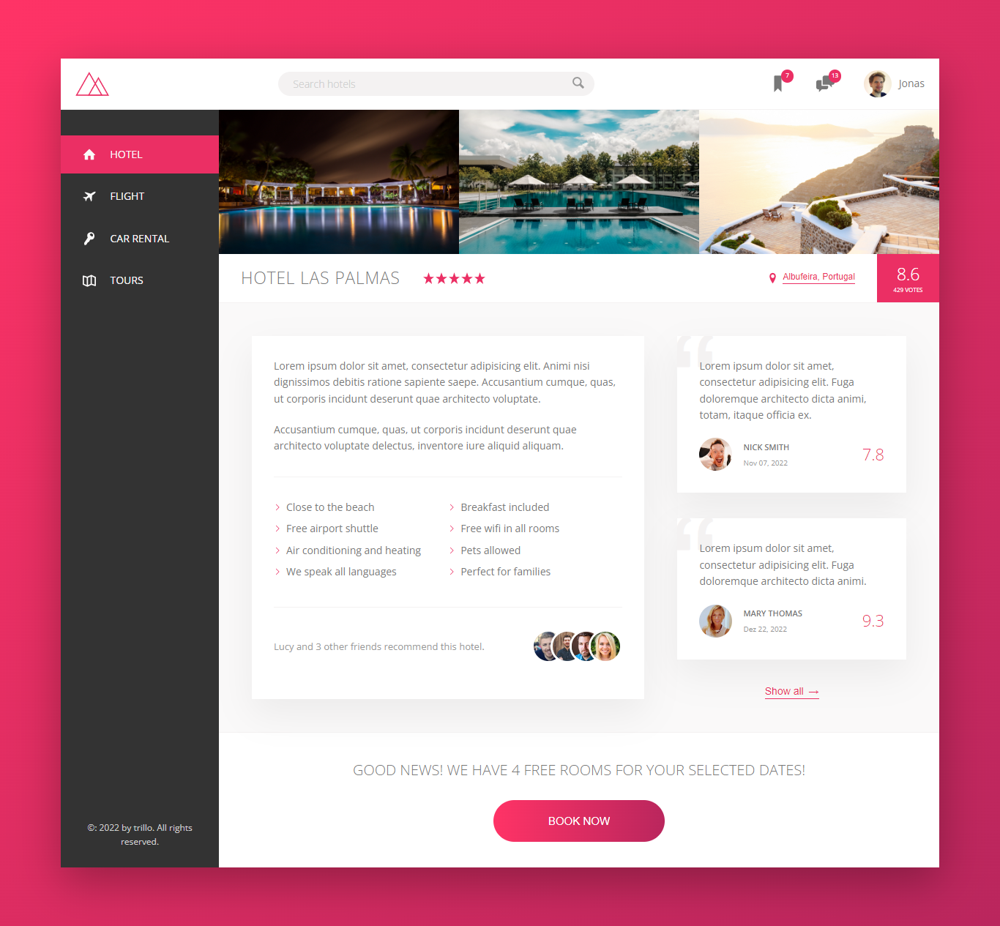
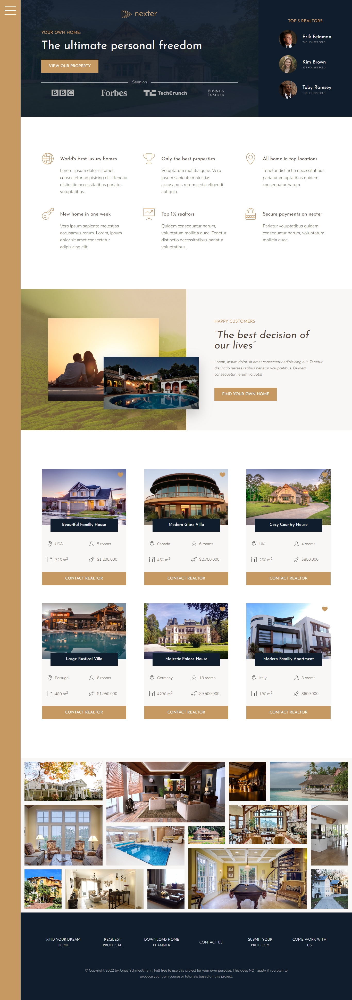

# Advanced CSS and Sass Course - Jonas Schmedtmann  

Foram desenvolvidos 3 projetos durante o curso:

### 1- Natours

Nesse projeto foram aplicadas técnicas de grade com `float`.

#### 🚀 ​ [Clique aqui](https://js-natours.netlify.app/)🔗 para acessar.

 

---

### 2- Trillo

Nesse projeto foram aplicadas técnicas de grade com `flex-box`.

#### 🚀 ​ [Clique aqui](https://js-trillo.netlify.app/)🔗 para acessar.

 

---

### 3- Nexter

Nesse projeto foram aplicadas técnicas de grade com `grid-layout`.

#### 🚀 ​ [Clique aqui](https://js-nexter.netlify.app/)🔗 para acessar.

 

---

### 📝 License

Esse projeto é licenciado pela MIT License. [Clique aqui](https://pt.wikipedia.org/wiki/Licen%C3%A7a_MIT)🔗 para mais detalhes.

Design: [@jonasschmedtman](https://twitter.com/jonasschmedtman)

---

#### 💬 Sinta-se a vontade para entrar em contato

  

[Clique aqui](https://brseghese.github.io)🔗 e acesse meu portfólio! 💼

---

> Desenvolvido com ❤️ por **Bruno Seghese**

---
